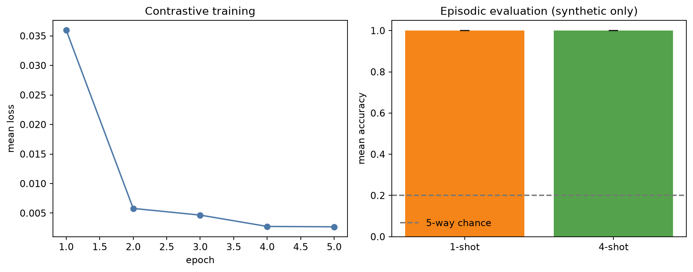

# Few-Shot Learning with Siamese Networks

[](https://github.com/Bahareh527/siamese_fewshot_project/actions/workflows/ci.yml)
[](https://www.python.org/)
[](LICENSE)

A reproducible PyTorch implementation of metric learning for few-shot image classification.
The project learns a normalized embedding space with contrastive or triplet supervision, then
classifies unseen episodes by distance to support-set prototypes.



## What this repository demonstrates

```text
image pairs / triplets -> shared residual encoder -> normalized embeddings
                                                     |
new support + query images -> class prototypes ------+-> nearest-prototype prediction
```

- Contrastive and triplet losses implemented from first principles
- Deterministic positive-pair, negative-pair, and triplet sampling
- Hard and semi-hard triplet mining within a mini-batch
- N-way K-shot episodes with disjoint support and query samples
- Mean episodic accuracy, standard deviation, and a 95% confidence interval
- Custom residual encoder and an optional pretrained ResNet18 baseline
- Strict checkpoint loading: evaluation never silently continues with random weights
- A fast synthetic example that runs without downloading a dataset

## Quick start

```bash
git clone https://github.com/Bahareh527/siamese_fewshot_project.git
cd siamese_fewshot_project
python -m venv .venv
# Windows: .venv\Scripts\activate
# macOS/Linux: source .venv/bin/activate
python -m pip install -e ".[notebook]"
python scripts/run_synthetic_demo.py
```

The [executed notebook](notebooks/synthetic_few_shot_demo.ipynb) explains the same workflow
interactively. All displayed results are from generated geometric patterns and are software
checks, not MiniImageNet benchmarks.

## Using a real image dataset

Keep datasets outside Git or under the ignored `data/` directory. Each split should use one
subdirectory per class:

```text
data/mini-imagenet/
  train/class_name/*.jpg
  validation/class_name/*.jpg
  test/class_name/*.jpg
```

```python
from siamese_fewshot import ImageFolderDataset

train = ImageFolderDataset("data/mini-imagenet/train", image_size=84)
test = ImageFolderDataset("data/mini-imagenet/test", image_size=84)
```

For a defensible few-shot evaluation, training classes must be disjoint from validation and test
classes. Select hyperparameters on validation classes, keep test classes untouched until final
evaluation, evaluate many independently sampled episodes, and report uncertainty—not only one
favorable episode.

## Pretrained ResNet18 baseline

Install the optional dependency and explicitly choose the source of pretrained weights:

```bash
python -m pip install -e ".[vision]"
```

```python
from siamese_fewshot.models import resnet18_encoder

encoder = resnet18_encoder(embedding_dim=256, imagenet_weights=True)
```

A Places365 checkpoint may instead be provided with `places365_checkpoint=...`. Random or
missing weights are rejected for this baseline so that an evaluation cannot appear successful
while using an untrained model.


## Reproducibility

The project seeds Python, NumPy, PyTorch, and the data-loader generator. Exact numerical
identity is not guaranteed across devices or PyTorch releases; save package versions, seeds,
configuration, and checkpoints for a serious experiment.

```bash
python -m pip install -e ".[dev]"
ruff check .
pytest
```

## References

- Vinyals et al., [Matching Networks for One Shot Learning](https://arxiv.org/abs/1606.04080)
- Snell et al., [Prototypical Networks for Few-shot Learning](https://arxiv.org/abs/1703.05175)
- Schroff et al., [FaceNet: A Unified Embedding for Face Recognition and Clustering](https://arxiv.org/abs/1503.03832)
- PyTorch, [Reproducibility notes](https://docs.pytorch.org/docs/stable/notes/randomness.html)

## License

The repository code is available under the [MIT License](LICENSE). Excluded datasets,
pretrained weights, and the original academic report are not covered by this license.
